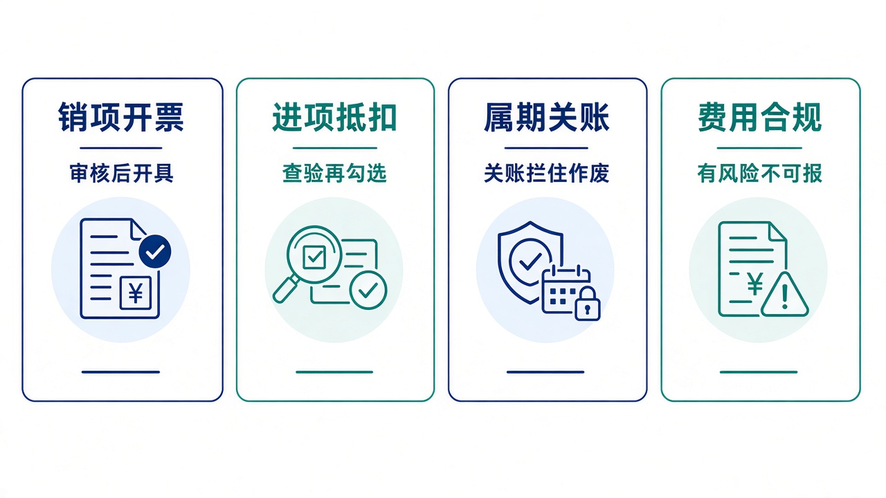
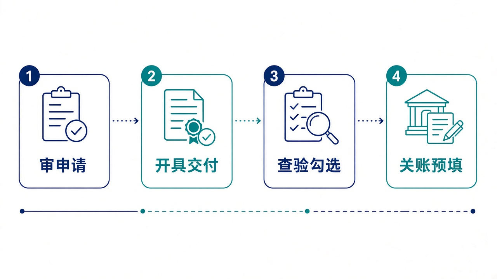

# 给大家讲：发票系统怎么用

INV 管销项开票、进项抵扣和税务属期。订单、结算、采购把单据推过来，开票和抵扣规则留在这里。控制塔可以查验、提交和审核，但必须带开放密钥，审核通过也不会自动开票。亮点短表见 [项目亮点](./项目亮点.md)。

## 适合什么场景

| 场景 | 在这里怎么做 |
| --- | --- |
| 要给客户开票 | 申请、审核、取号开具、交付。超限额会拆分，专票校验必填项 |
| 收到供应商发票 | 录入、查重、查验、勾选抵扣，再按采购和收货做匹配、入账 |
| 这个月要关账 | 关账后，销项作废和进项勾选不再放行。申报数按属期预填 |
| 员工拿发票报销 | 先过合规。重复、抬头不符、过期、查验失败或超额，不能报销 |
| 控制塔想推进一张申请 | 它只能提交或审核。开具、交付、红冲仍在本系统 |

## 亮点

1. 销项能走到作废和红冲，税额按行计算并做容差校验。
2. 进项状态能单独给控制塔看，不和销项混在一张状态里。
3. 属期关账会拦住不该再做的动作。
4. 上游推送和控塔指令分开。推送按来源单号幂等。

## 一天怎么用

1. 看工作台的待审核、待开票、待查验。
2. 审核销项申请，再开具和交付。
3. 查验进项，确认后再勾选抵扣。
4. 月底关账，看申报预填和税负。关账后不要再尝试作废本月已关的票。
