# INV 发票管理系统 项目汇报

> 汇报口径：截至 2026-09-28 `main` 分支（PR #1 ～ #24 已全部合并）。截图均取自本次汇报时在最新 `main` 上实际运行的系统（演示数据）。

## 一、一句话总结

INV 是一套进销项一体化的发票管理与税务合规平台：销项从开票申请到审核、取号开具、交付、作废/红冲全链路闭环；进项从录入到查重、查验、勾选抵扣、三单匹配、入账全链路闭环；并提供费用票合规、属期关账、增值税申报预填、电子档案、开放接口和控制塔对接。技术栈 Java 8 语法（Spring Boot 2.7 + MyBatis-Plus）+ Vue 3（Element Plus），对标用友、金蝶发票云的核心能力。

## 二、交付概况

| 指标 | 数值 |
| --- | --- |
| 开发周期 | 2026-09-14 ～ 2026-09-28（两周） |
| 合并 PR | 24 个（功能 12、缺陷修复/加固 7、文档 3、测试 skill 2） |
| 后端 | 92 个 Java 文件、约 5,500 行；85 个 REST 接口；23 张数据表 |
| 前端 | 16 个业务页面、31 个 Vue/JS 文件、约 2,700 行 |
| 自动化测试 | 31 个 JUnit 5 集成测试（H2 内存库）+ 端到端冒烟脚本 `scripts/smoke.sh` |
| 浏览器回归 | 两轮完整端到端回归（PR #1 合并后、Release 后），全部通过 |
| 发布形态 | 单 JAR、便携包（Linux/macOS/Windows）、捆绑 JRE 的原生包（GitHub Actions 自动发行） |
| 数据库 | H2（开发/测试），MySQL 8（已在 Docker 验证冒烟通过） |

## 三、系统架构

```text
 上游系统                       INV                                     下游/协作
┌────────┐   /api/open/**    ┌────────────────────────────────┐
│ OMS/BMS│ ───开票申请推送──▶ │ integration  Open API / 集成日志 │
│ SRM    │ ───进项票推送────▶ │              电子档案            │
└────────┘                   │                                │   ┌──────────┐
┌────────┐  /api/open/ir/**  │ sales   申请→审核→开具→交付→红冲 │◀─▶│ 控制塔 IR │
│ 控制塔  │ ◀─快照/指令─────▶ │ purchase 录入→查重→查验→勾选→入账 │   └──────────┘
└────────┘                   │ expense 合规检查→报销            │
                             │ tax     属期关账 / 增值税预填     │
┌────────┐   Bearer Token    │ report  工作台 / 统计 / CSV       │
│ Vue 前端│ ◀───/api/**─────▶ │ basic   主体 / 往来 / 商品 / 号段 │
│ Element│                   │ system  用户 / 角色 / 操作日志    │
└────────┘                   └──────────────┬─────────────────┘
                                            │ MyBatis-Plus
                                     ┌──────┴──────┐
                                     │ H2 / MySQL 8│
                                     └─────────────┘
```

- 后端按业务域分包：`basic / sales / purchase / expense / tax / integration / report / system / common`。
- 认证：登录换取 Bearer Token；`/api/open/**` 走 `X-Api-Key`，供上游系统和控制塔调用。
- 授权：`AccessPolicy` 统一按角色 + HTTP 方法 + 路径判定；前端按角色隐藏无权按钮，后端兜底 403。
- 所有发票写路径（开票、作废、红冲、交付、取号）在事务内 `SELECT ... FOR UPDATE` 行锁，防止并发覆盖状态。

## 四、功能全景（图文）

### 4.1 登录与工作台

登录页支持连续 5 次错误密码后锁定 15 分钟。工作台汇总今日开票、本月销项/进项税额、异常进项、费用风险、待办、近 12 个月趋势和号段余量预警。


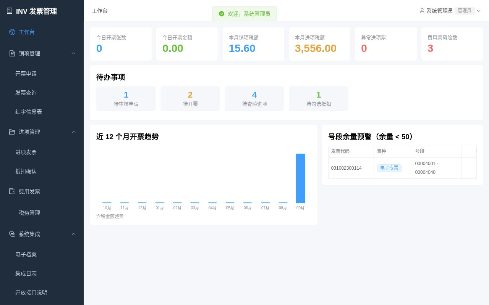

### 4.2 销项管理：申请 → 审核 → 开具 → 交付 → 作废/红冲

- 开票申请支持手工、OMS/BMS 推送、导入四种来源，`source + extRef` 幂等；行级税额计算（HALF_UP，±0.06 容差）、含税录入反算、专票必填校验、超限额自动拆分、多申请合并。
- 开具时按号段原子取号；数电票生成 20 位号码；明细超过 8 行的专票自动标记销货清单。
- 作废仅限当月纸质票；电子票及跨月票走红字信息表 + 部分/全额红冲；支持 EMAIL/SMS 交付、批量操作与 CSV 导出。

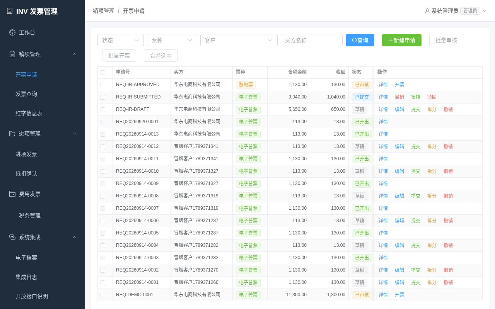

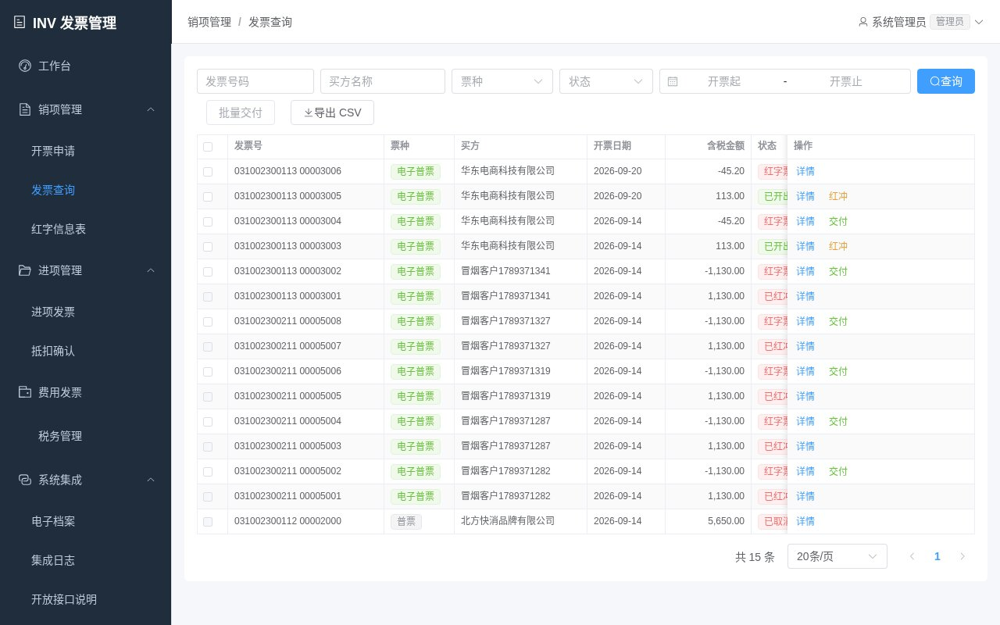

发票详情抽屉包含明细行、事件轨迹（ISSUED / DELIVERED / RED_FLUSHED …）与交付记录，形成完整审计线：

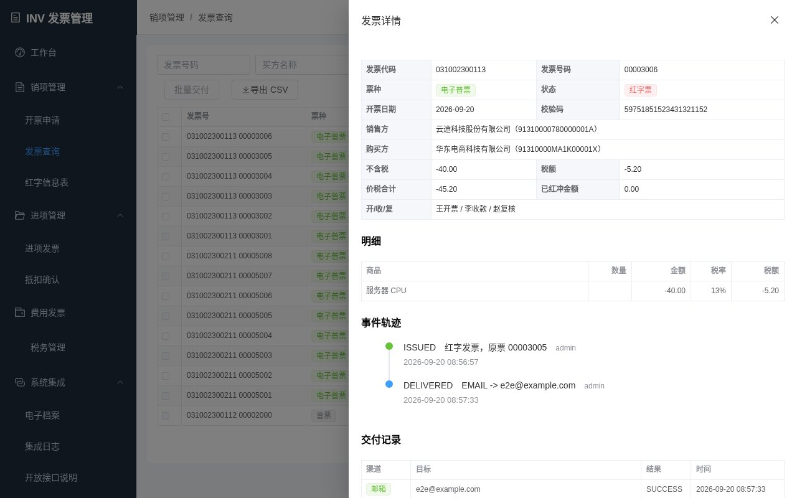

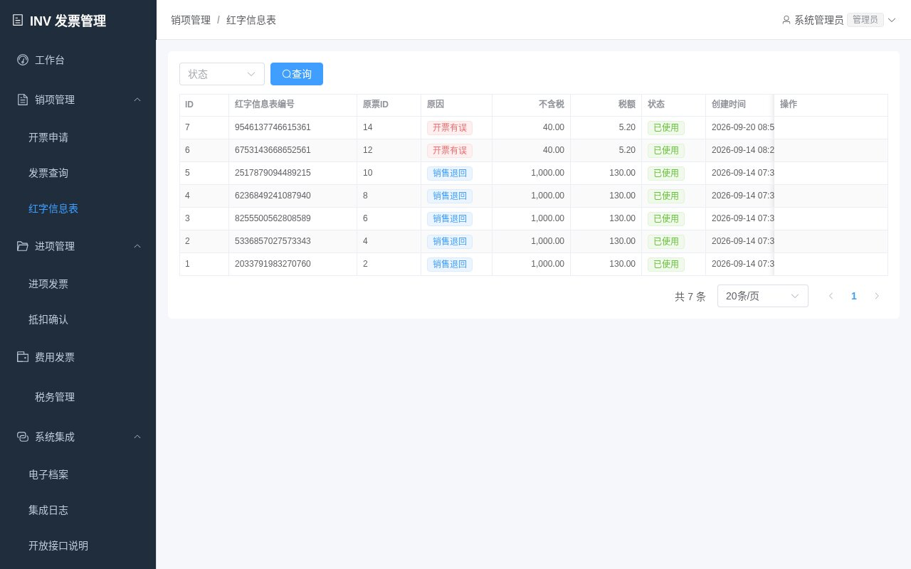

### 4.3 进项管理：录入 → 查重 → 查验 → 勾选抵扣 → 三单匹配 → 入账

- 查重按 `(invoice_code, invoice_no)`；查验以校验码派生值比对，抬头税号不属于本企业主体时标 ABNORMAL；查验结果分为通过 / 抬头不符 / 校验码失败三类。
- 勾选指定属期，确认抵扣生成 `DeductionBatch`；支持不抵扣标记。
- 三单匹配按采购金额与收货数量比对（金额差 ≤ 0.01 且数量相等为 MATCHED）；入账生成模拟凭证号。

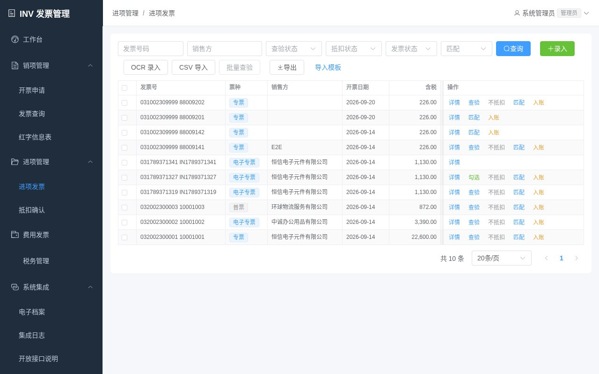

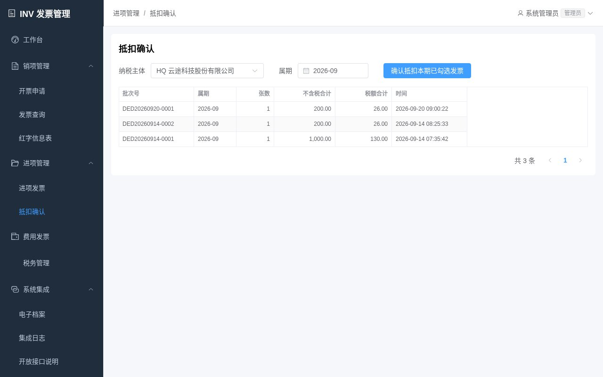

### 4.4 费用发票合规

员工费用票先过合规检查，输出 DUPLICATE / TITLE_MISMATCH / EXPIRED / VERIFY_FAILED / AMOUNT_LIMIT 风险项，无风险才可报销，可驳回。

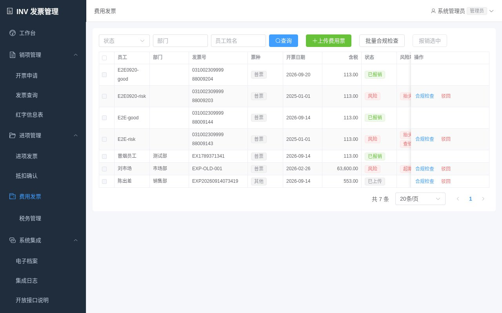

### 4.5 税务管理：增值税预填与属期关账

- 增值税申报预填按税率给出销项净额、已抵扣进项、应纳税额/留抵、税负率预警，并支持“再勾选 N 元进项税”预演。
- 属期关账后，该期销项作废和进项勾选/抵扣确认被拦截；红冲不受限。

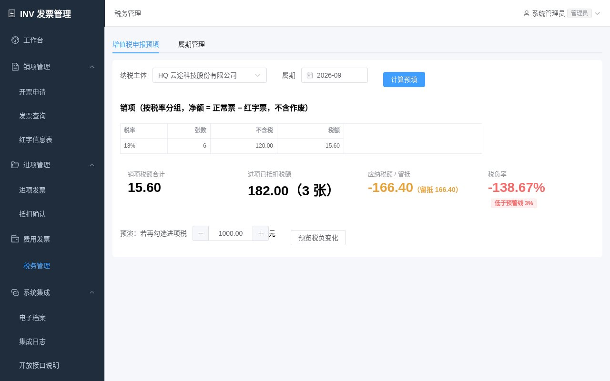

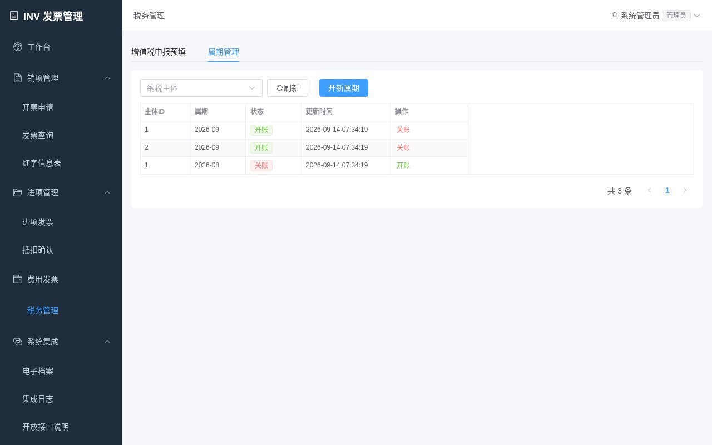

### 4.6 报表分析

销项统计（按月/主体/客户/票种）、进项统计（按供应商/抵扣状态）、红冲/作废统计、客户开票排名 TOP10，均支持开票日期区间筛选并同步到 CSV 导出（#23）。

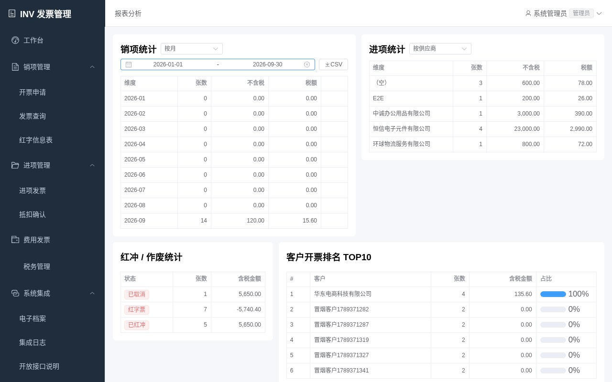

### 4.7 系统集成：电子档案、开放接口、控制塔

- 开票/红冲自动归档（模拟 PDF/OFD），按月查询导出。
- `/api/open/**`：OMS/BMS 推送开票申请并查询状态、SRM 推送进项票。
- `/api/open/ir/**`：控制塔读取申请/销项/进项快照，下发查验、提交、审核、开具、三单匹配指令；审核不自动开票，开具是独立指令。

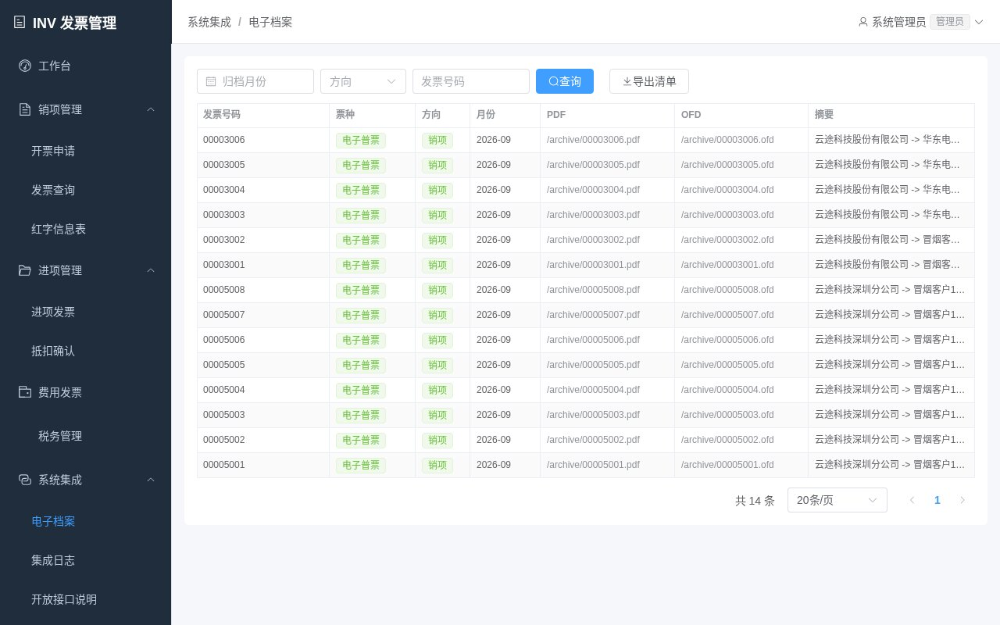

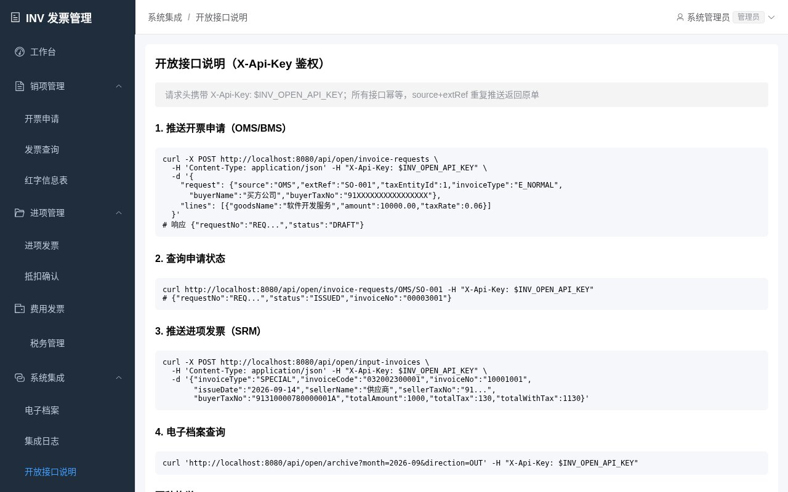

### 4.8 基础数据与系统管理

纳税主体（含分票种开票限额）、往来单位、商品/服务（税收分类编码、税率档）、发票号段库存；用户与四级角色（ADMIN / FINANCE / OPERATOR / VIEWER）、操作日志。

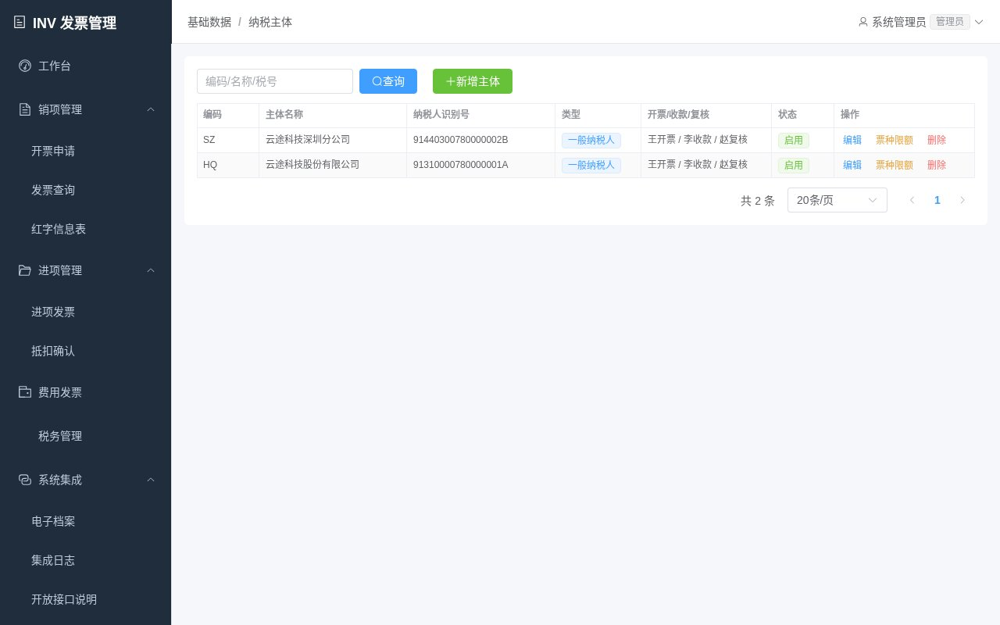

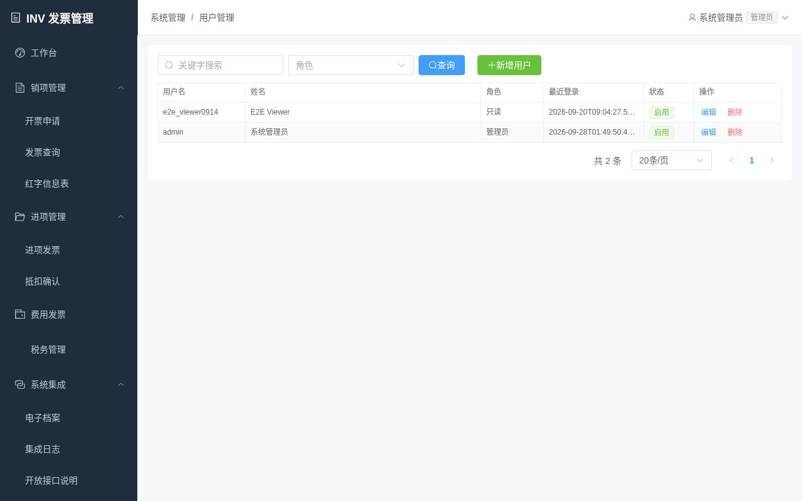

## 五、质量保障

### 5.1 自动化测试

| 层次 | 内容 |
| --- | --- |
| 单元/集成测试（31 个） | 税额与容差、限额拆分、专票必填、并发取号、并发开票/作废/红冲/交付、进项查重查验、抵扣批次、三单匹配、费用合规、Open API 幂等、增值税预填、报表日期区间与导出、登录锁定容量 |
| 冒烟脚本 | 登录 → 建客户/商品 → 申请 → 提交 → 审核 → 开票 → 交付 → 红冲 → 进项录入/查验/勾选/抵扣 → 费用票 → 预填 → 报表/档案断言 |
| 数据库兼容 | H2 全量测试；MySQL 8（Docker）建表 + 冒烟通过 |

### 5.2 浏览器端到端回归（两轮，全部通过）

覆盖：admin 登录与工作台；不含税 100 / 含税 113 双向税额计算；申请提交 → 审核 → 开票 → 详情 → EMAIL 交付；部分红冲（红票 -45.20，原票剩余净额 60 / 税 7.80）；电子票作废拒绝；已作废票交付/红冲拒绝；关账拦截作废与勾选、开账后恢复；进项重复录入、错误校验码、正确查验、抵扣批次；风险费用票禁止报销、合规票报销成功；增值税预填与报表金额一致；基础数据 CRUD；报表各维度与日期区间边界（反向日期、1899/10000 年拒绝，1900/9999 可查）；VIEWER 全页面只读且 23 个代表性写接口 403；连续 5 次错误密码锁定。

### 5.3 代码评审闭环

每个 PR 均经过自动代码评审，发现的真实缺陷全部在后续 PR 中修复并合并，主要包括：

| 问题 | 修复 |
| --- | --- |
| 同一申请并发重复开票 | `UPDATE ... WHERE status='APPROVED' AND invoice_id IS NULL` 条件更新 + 行锁 |
| 红冲超额、作废/交付并发覆盖状态 | 所有 `inv_invoice` 写路径统一 `FOR UPDATE` |
| 已作废票仍可红冲 | 红冲校验原票状态 |
| 按月报表把日期区间扩成整月 | 按相交月份 + 实际区间过滤 |
| 报表极端日期溢出 | 年份限定 1900 ～ 9999，from ≤ to |
| 登录失败表无界增长 / 并发突破上限 | 过期清理 + 最旧淘汰 + 同步容量检查 |
| VIEWER 可见基础数据写按钮 | 前端按角色隐藏 |
| 快速切换报表日期显示旧数据 | 丢弃过期响应（#24） |
| SQL 脚本 H2/MySQL 不兼容 | 索引内联建表、演示数据改为 Java 初始化、日期计算改在 Java 完成 |

## 六、发布与运行

| 形态 | 说明 |
| --- | --- |
| 单 JAR | 前端构建打进 Spring Boot JAR，`java -jar inv-backend-1.0.0.jar --server.port=8089` |
| 便携包 | `scripts/package-release.sh` 生成 zip，含 `start.sh / start.command / start.bat` |
| 原生包 | 合并到 `main` 且冒烟通过后 GitHub Actions 自动发布 Release：linux-x64 / windows-x64 / macos-arm64 / macos-x64，捆绑 JRE，双击即用 |
| 配置 | 管理员口令、Open API Key、令牌密钥、CORS、登录锁定策略、费用合规阈值、税负预警阈值均由环境变量控制 |

## 七、与竞品能力对照

| 能力 | 用友/金蝶发票云 | INV 现状 |
| --- | --- | --- |
| 销项申请/审核/开具/交付 | 有 | 有（含拆分、合并、批量） |
| 数电票 | 有 | 有（20 位号码，模拟税控） |
| 作废/红冲 | 有 | 有（部分/全额，红字信息表） |
| 进项查验/勾选抵扣 | 有 | 有（模拟税局查验） |
| 三单匹配 | 有 | 有（金额 + 数量容差） |
| 费用票合规 | 有 | 有（5 类风险规则） |
| 增值税申报预填 | 有 | 有（分税率、留抵、税负率） |
| 电子档案 | 有 | 有（模拟 PDF/OFD） |
| 上游集成 | 有 | 有（Open API 幂等、控制塔指令） |
| 真实税控/税局对接 | 有 | 未接入（预留接口，见下） |
| OCR 识票 | 有 | 模拟 `/scan` |
| 多租户 | 有 | 单租户多主体 |

## 八、已知边界与后续规划

当前边界：

- 税控开票、税局查验、数电票为模拟实现，未接入真实税局/税控服务商。
- OCR 为模拟接口；登录锁定为内存级（多实例不共享）；未做 Redis/Flyway。
- 未做 MySQL 压测与并发容量压测。

后续建议（按优先级）：

1. 接入真实税控服务商（如乐企/税控盘/数电乐企接口）与税局查验接口，替换模拟实现。
2. 引入 Flyway 管理 schema 演进；登录锁定与幂等键迁移到 Redis 以支持多实例。
3. 接入 OCR 供应商，完善进项票批量识别。
4. 多租户与数据权限（按主体隔离）。
5. 报表增加图表化与自定义导出模板。

## 附：相关文档

- [README](../README.md)：功能范围、快速开始、状态机、规则要点
- [技术方案](技术方案.md)：控制塔对接与主链路
- [图文导读](图文导读.md)：面向业务用户的使用说明
- [项目亮点](项目亮点.md)
